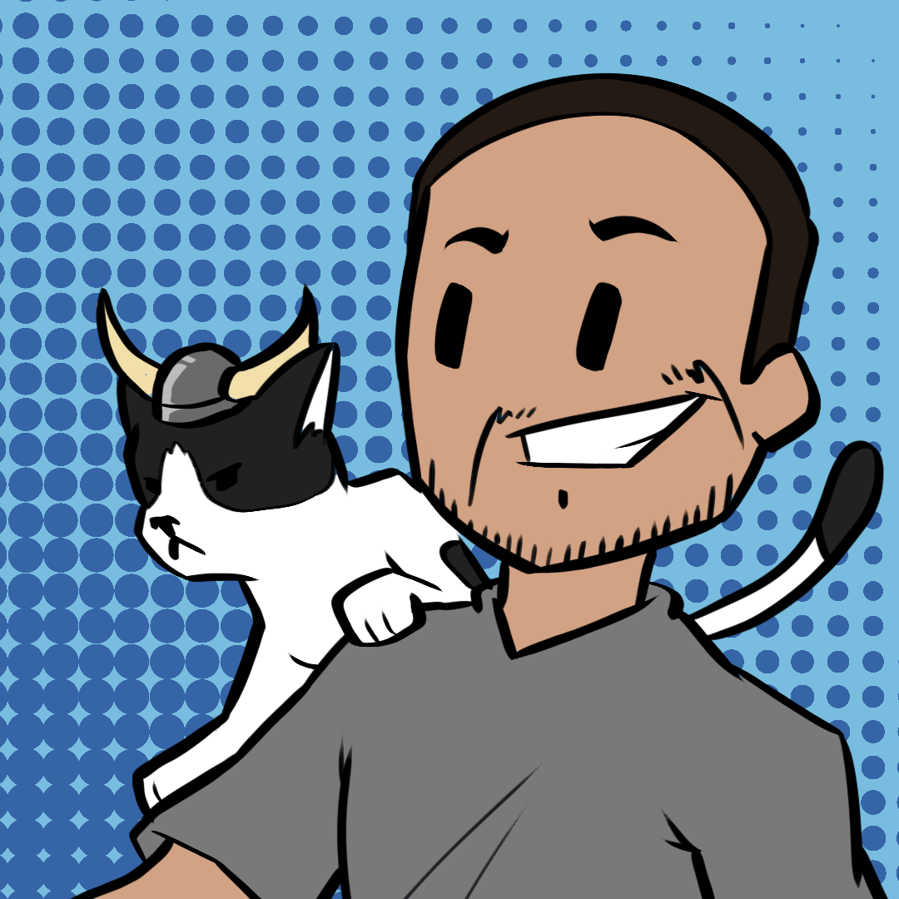

    

<h1 align="center">Hey there! I'm Spencer, welcome to my profile!</h1>

    
    
    

 

  

<h2 align="center">Fun Facts About Me</h2>

  <ul>
    <li>🌱 I am from the state of Arkansas in the United States.</li>
    <li>🧍 I am a father to two beautiful children</li>
    <li>👨‍💻 My programming language of choice is Python, but I love working with JavaScript (React and Angular) as well as Java (Spring Boot).</li>
    <li>⚡ I am an accreditted voice actor for the game, Hell Let Loose.</li>
    <li>⛷️ My favorite sport is American Football and I'm a fan of the Dallas Cowboys!</li>
  </ul>

 

<h2 align="center">My GitHub Stats</h2>

  
  

 

<h4 align="center"><i>Like one of my projects? Support me by forking and starring ⭐ it!</i></h4>
